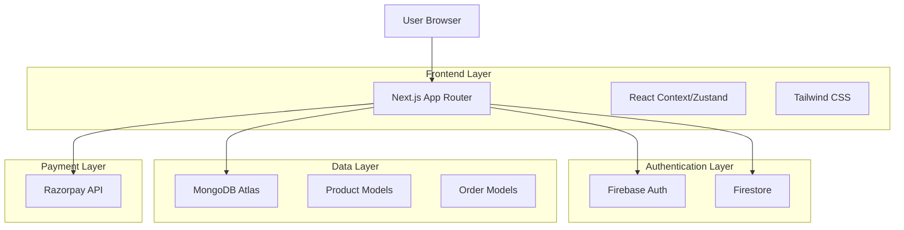
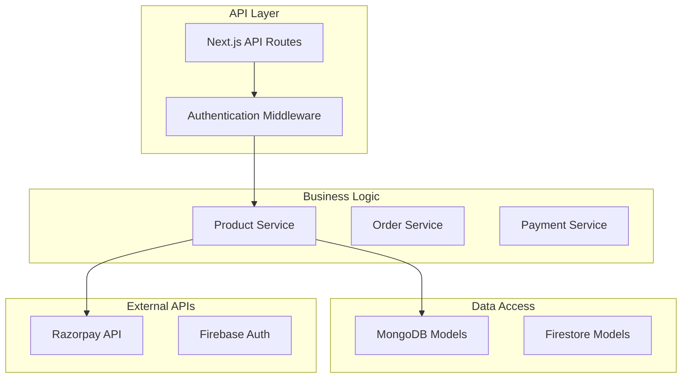
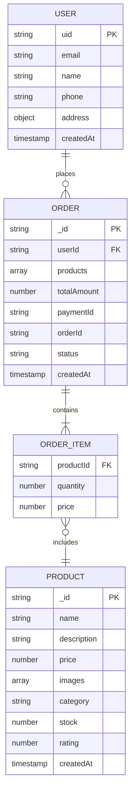

## 1. Architecture Design



## 2. Technology Description

- **Frontend**: Next.js 14+ (App Router) + TypeScript + Tailwind CSS
- **Initialization Tool**: create-next-app
- **Authentication**: Firebase Authentication + Firestore
- **Database**: MongoDB Atlas with Mongoose ODM
- **Payment Gateway**: Razorpay (India-specific)
- **State Management**: React Context API / Zustand
- **Styling**: Tailwind CSS with custom configuration
- **Deployment**: Vercel (frontend) + MongoDB Atlas (database)

## 3. Route Definitions

| Route | Purpose |
|-------|---------|
| `/` | Homepage with hero section and featured products |
| `/products` | Product listing page with filters and pagination |
| `/product/[id]` | Individual product details page |
| `/cart` | Shopping cart with item management |
| `/checkout` | Checkout process with payment integration |
| `/profile` | User profile and order history |
| `/login` | User authentication page |
| `/register` | User registration page |
| `/admin` | Admin panel for product/order management |
| `/api/products` | REST API for product operations |
| `/api/orders` | REST API for order management |
| `/api/razorpay` | Payment processing endpoints |

## 4. API Definitions

### 4.1 Product API

**Get All Products**
```
GET /api/products
```

Query Parameters:
| Param Name | Type | Required | Description |
|------------|------|----------|-------------|
| page | number | false | Page number for pagination |
| limit | number | false | Items per page |
| category | string | false | Filter by category |
| search | string | false | Search term |
| sort | string | false | Sort field (price, rating, createdAt) |
| order | string | false | Sort order (asc/desc) |

Response:
```json
{
  "products": [
    {
      "_id": "string",
      "name": "string",
      "description": "string",
      "price": "number",
      "images": ["string"],
      "category": "string",
      "stock": "number",
      "rating": "number",
      "createdAt": "Date"
    }
  ],
  "total": "number",
  "page": "number",
  "totalPages": "number"
}
```

**Get Product by ID**
```
GET /api/products/[id]
```

Response:
```json
{
  "_id": "string",
  "name": "string",
  "description": "string",
  "price": "number",
  "images": ["string"],
  "category": "string",
  "stock": "number",
  "rating": "number",
  "createdAt": "Date"
}
```

### 4.2 Order API

**Create Order**
```
POST /api/orders
```

Request Body:
```json
{
  "userId": "string",
  "products": [
    {
      "productId": "string",
      "quantity": "number",
      "price": "number"
    }
  ],
  "totalAmount": "number",
  "shippingAddress": {
    "name": "string",
    "phone": "string",
    "address": "string",
    "city": "string",
    "state": "string",
    "pincode": "string"
  }
}
```

Response:
```json
{
  "orderId": "string",
  "status": "pending",
  "paymentId": "string",
  "createdAt": "Date"
}
```

### 4.3 Razorpay API

**Create Razorpay Order**
```
POST /api/razorpay/create-order
```

Request Body:
```json
{
  "amount": "number",
  "currency": "INR",
  "receipt": "string"
}
```

Response:
```json
{
  "id": "string",
  "amount": "number",
  "currency": "INR",
  "status": "created"
}
```

**Verify Payment**
```
POST /api/razorpay/verify-payment
```

Request Body:
```json
{
  "razorpay_order_id": "string",
  "razorpay_payment_id": "string",
  "razorpay_signature": "string"
}
```

## 5. Server Architecture Diagram



## 6. Data Model

### 6.1 Data Model Definition



### 6.2 Data Definition Language

**Product Model (MongoDB)**
```javascript
// Mongoose Schema
const ProductSchema = new mongoose.Schema({
  name: {
    type: String,
    required: true,
    trim: true
  },
  description: {
    type: String,
    required: true
  },
  price: {
    type: Number,
    required: true,
    min: 0
  },
  images: [{
    type: String,
    required: true
  }],
  category: {
    type: String,
    required: true,
    enum: ['electronics', 'clothing', 'books', 'home', 'sports', 'other']
  },
  stock: {
    type: Number,
    required: true,
    min: 0,
    default: 0
  },
  rating: {
    type: Number,
    default: 0,
    min: 0,
    max: 5
  },
  createdAt: {
    type: Date,
    default: Date.now
  }
});

// Indexes
ProductSchema.index({ category: 1 });
ProductSchema.index({ price: 1 });
ProductSchema.index({ rating: -1 });
ProductSchema.index({ name: 'text', description: 'text' });
```

**Order Model (MongoDB)**
```javascript
// Mongoose Schema
const OrderSchema = new mongoose.Schema({
  userId: {
    type: String,
    required: true,
    ref: 'User'
  },
  products: [{
    productId: {
      type: mongoose.Schema.Types.ObjectId,
      ref: 'Product',
      required: true
    },
    quantity: {
      type: Number,
      required: true,
      min: 1
    },
    price: {
      type: Number,
      required: true,
      min: 0
    }
  }],
  totalAmount: {
    type: Number,
    required: true,
    min: 0
  },
  paymentId: {
    type: String,
    required: true
  },
  orderId: {
    type: String,
    required: true,
    unique: true
  },
  status: {
    type: String,
    enum: ['pending', 'confirmed', 'shipped', 'delivered', 'cancelled'],
    default: 'pending'
  },
  shippingAddress: {
    name: { type: String, required: true },
    phone: { type: String, required: true },
    address: { type: String, required: true },
    city: { type: String, required: true },
    state: { type: String, required: true },
    pincode: { type: String, required: true }
  },
  createdAt: {
    type: Date,
    default: Date.now
  }
});

// Indexes
OrderSchema.index({ userId: 1 });
OrderSchema.index({ status: 1 });
OrderSchema.index({ createdAt: -1 });
```

**User Profile (Firestore)**
```javascript
// Firestore Document Structure
{
  uid: "string", // Firebase Auth UID
  email: "string",
  name: "string",
  phone: "string",
  address: {
    line1: "string",
    line2: "string",
    city: "string",
    state: "string",
    pincode: "string"
  },
  createdAt: "timestamp",
  updatedAt: "timestamp",
  isAdmin: "boolean" // For admin access control
}
```

## 7. Environment Configuration

**Required Environment Variables:**
```bash
# Firebase Configuration
NEXT_PUBLIC_FIREBASE_API_KEY=
NEXT_PUBLIC_FIREBASE_AUTH_DOMAIN=
NEXT_PUBLIC_FIREBASE_PROJECT_ID=
NEXT_PUBLIC_FIREBASE_STORAGE_BUCKET=
NEXT_PUBLIC_FIREBASE_MESSAGING_SENDER_ID=
NEXT_PUBLIC_FIREBASE_APP_ID=

# MongoDB Configuration
MONGODB_URI=
MONGODB_DB_NAME=

# Razorpay Configuration
RAZORPAY_KEY_ID=
RAZORPAY_KEY_SECRET=
NEXT_PUBLIC_RAZORPAY_KEY_ID=

# Application Configuration
NEXT_PUBLIC_BASE_URL=
NEXT_PUBLIC_ADMIN_UIDS= # Comma-separated list of admin UIDs
```

## 8. Security Considerations

- **Authentication**: Firebase JWT token validation on protected routes
- **Input Validation**: Server-side validation for all API endpoints
- **CORS**: Configured for production domains only
- **Rate Limiting**: Implemented on API routes
- **Environment Variables**: All sensitive data in environment variables
- **HTTPS**: Enforced in production
- **Content Security Policy**: Configured for Razorpay integration
- **Database Security**: MongoDB connection with SSL/TLS
- **Payment Security**: Razorpay signature verification on server-side