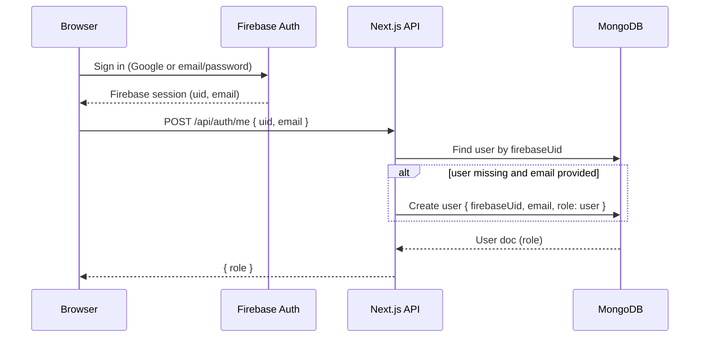
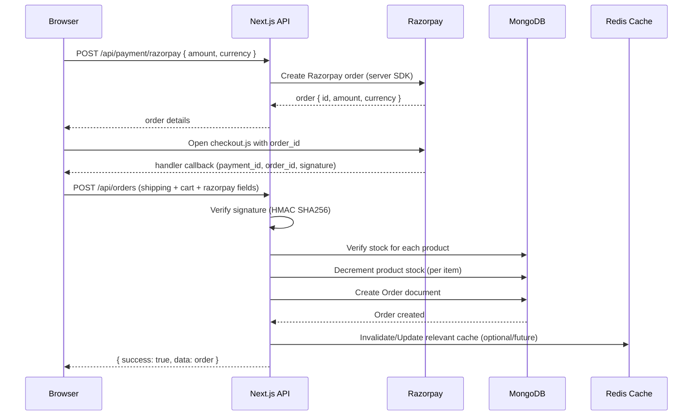
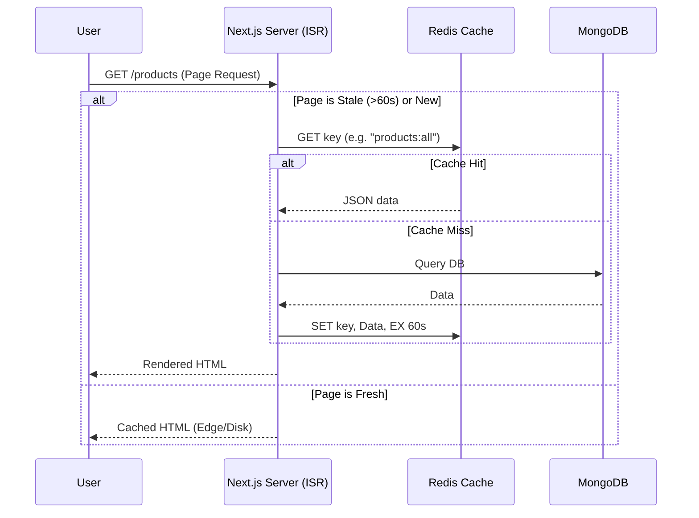
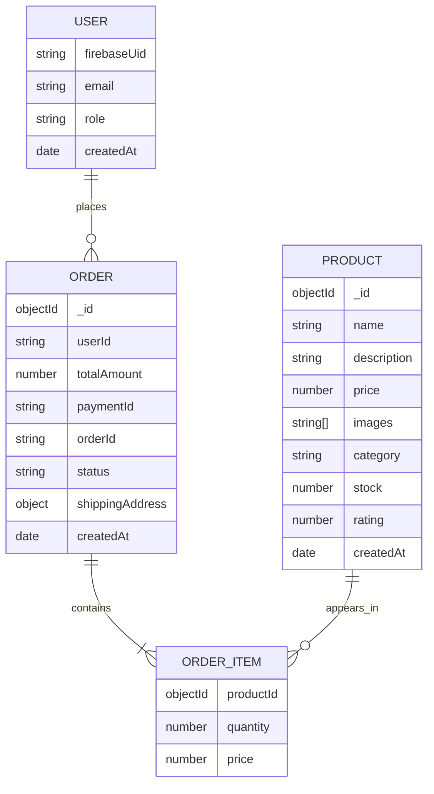

# E-Commerce System Architecture (Next.js + Firebase Auth + MongoDB + Razorpay)

This document describes the current architecture of this repository: runtime boundaries, component breakdown, API logic, and MongoDB schema documentation.

## 1. High-Level Architecture

```mermaid
graph TD
  Browser[User Browser] --> Next[Next.js App Router]
  Next --> Firebase[Firebase Authentication]
  Next --> Mongo[MongoDB Atlas via Mongoose]
  Next --> Redis[Redis Cache (Upstash/Custom)]
  Next --> Razorpay[Razorpay Orders API]
  Next --> Cloudinary[Cloudinary API]

  subgraph Client[Client Runtime (Browser)]
    UI[React UI Components]
    AuthCtx[AuthContext]
    CartCtx[CartContext (LocalStorage)]
    Theme[Theme Provider (next-themes)]
    RazorpayJS[Razorpay Checkout JS]
  end

  subgraph Server[Server Runtime (Next.js)]
    RSC[Server Components]
    API[Route Handlers /app/api/*]
    Models[Mongoose Models]
  end

  Browser --> UI
  UI --> AuthCtx
  UI --> CartCtx
  UI --> Theme
  UI --> RazorpayJS

  RSC --> Models
  API --> Models
  API --> Cloudinary
```

### What runs where

- Browser: UI, theme switching, cart persistence, Firebase sign-in, Razorpay checkout modal.
- Next.js server: server-side product reads (RSC + Redis), all API routes (orders/products/admin/upload/payment), Razorpay server SDK call, MongoDB reads/writes, Cloudinary uploads.
- External services: Firebase Auth (identity), MongoDB (data), Razorpay (payments), Cloudinary (images), Redis (cache).

## 2. Tech Stack (as implemented)

- Next.js App Router (Next 16) + React + TypeScript
- Styling: Tailwind CSS
- Auth: Firebase Authentication (client SDK + Admin SDK)
- Database: MongoDB Atlas via Mongoose
- Caching: Redis (ioredis + ISR)
- Payments: Razorpay (server order creation + client checkout.js + server signature verification)
- Images: Cloudinary (storage + CDN)
- Theme: next-themes + theme-toggles
- Animation: GSAP (used by ScrollReveal)

Notes:
- Firestore is initialized in the Firebase client ([firebase.ts](file:///c:/Users/hp/Downloads/ecomtrae/ecommtrae/src/lib/firebase.ts)) but is not used by the current app logic.
- Zustand is installed but the state management in this app is React Context (AuthContext + CartContext).

## 3. Frontend Architecture

### 3.1 Providers (global app composition)

Root layout composes providers and the persistent navbar:

- Root layout: [layout.tsx](file:///c:/Users/hp/Downloads/ecomtrae/ecommtrae/src/app/layout.tsx#L16-L49)
  - ThemeProvider: [ThemeProvider.tsx](file:///c:/Users/hp/Downloads/ecomtrae/ecommtrae/src/components/ThemeProvider.tsx)
  - AuthProvider: [AuthContext.tsx](file:///c:/Users/hp/Downloads/ecomtrae/ecommtrae/src/context/AuthContext.tsx)
  - CartProvider: [CartContext.tsx](file:///c:/Users/hp/Downloads/ecomtrae/ecommtrae/src/context/CartContext.tsx)
  - Navbar: [Navbar.tsx](file:///c:/Users/hp/Downloads/ecomtrae/ecommtrae/src/components/Navbar.tsx)

### 3.2 State management (current)

**AuthContext**
- Source of truth: Firebase Auth client session.
- When Firebase reports a user, the app calls `/api/auth/me` to create/read the MongoDB user record and fetch role (user/admin).
- Used by:
  - Navbar (show admin link / profile / logout)
  - Admin layout gatekeeping
  - Checkout & Profile route protections (client-side redirects)

Relevant code:
- AuthContext: [AuthContext.tsx](file:///c:/Users/hp/Downloads/ecomtrae/ecommtrae/src/context/AuthContext.tsx#L27-L109)
- Role fetch endpoint: [auth/me/route.ts](file:///c:/Users/hp/Downloads/ecomtrae/ecommtrae/src/app/api/auth/me/route.ts)

**CartContext**
- Source of truth: browser localStorage key `cart`.
- Holds cart items and derived totals (totalItems, subtotal).
- Enforces stock constraints on client (best-effort; server still re-checks stock when creating an order).

Relevant code:
- CartContext: [CartContext.tsx](file:///c:/Users/hp/Downloads/ecomtrae/ecommtrae/src/context/CartContext.tsx)

**Theme**
- ThemeProvider uses `class` attribute on `<html>` and toggles `.dark`.
- ThemeToggle adds a temporary `theme-transition` class on `<html>` to animate color changes.

Relevant code:
- ThemeToggle: [ThemeToggle.tsx](file:///c:/Users/hp/Downloads/ecomtrae/ecommtrae/src/components/ThemeToggle.tsx)
- Transition CSS: [globals.css](file:///c:/Users/hp/Downloads/ecomtrae/ecommtrae/src/app/globals.css#L119-L124)

### 3.3 Page (route) breakdown and logic

**Public browsing (Cached)**
- `/` Home: ISR (revalidate=60s) + Redis cache; fetches latest products: [page.tsx](file:///c:/Users/hp/Downloads/ecomtrae/ecommtrae/src/app/page.tsx)
- `/products` Listing: ISR (revalidate=60s) + Redis cache; dynamic keys based on search/category: [products/page.tsx](file:///c:/Users/hp/Downloads/ecomtrae/ecommtrae/src/app/products/page.tsx)
- `/product/[id]` Details: ISR (revalidate=60s) + Redis cache; fetches product by ID: [product/[id]/page.tsx](file:///c:/Users/hp/Downloads/ecomtrae/ecommtrae/src/app/product/%5Bid%5D/page.tsx)

**Cart + Checkout**
- `/cart`: client page driven by CartContext: [cart/page.tsx](file:///c:/Users/hp/Downloads/ecomtrae/ecommtrae/src/app/cart/page.tsx)
- `/checkout`: client page guarded by auth + cart contents; creates Razorpay order then finalizes order via `/api/orders`: [checkout/page.tsx](file:///c:/Users/hp/Downloads/ecomtrae/ecommtrae/src/app/checkout/page.tsx)

**Auth**
- `/login`: client page; supports Google sign-in and email/password; uses `redirect` query param: [login/page.tsx](file:///c:/Users/hp/Downloads/ecomtrae/ecommtrae/src/app/login/page.tsx)
- `/register`: client page; creates Firebase user + displayName: [register/page.tsx](file:///c:/Users/hp/Downloads/ecomtrae/ecommtrae/src/app/register/page.tsx)

**Profile**
- `/profile`: client page; fetches user orders from `/api/orders` using `x-user-uid` header: [profile/page.tsx](file:///c:/Users/hp/Downloads/ecomtrae/ecommtrae/src/app/profile/page.tsx)

**Admin**
- `/admin`: admin dashboard (client) loads stats from `/api/admin/stats`: [admin/page.tsx](file:///c:/Users/hp/Downloads/ecomtrae/ecommtrae/src/app/admin/page.tsx)
- `/admin/products`: CRUD + image upload flow: [admin/products/page.tsx](file:///c:/Users/hp/Downloads/ecomtrae/ecommtrae/src/app/admin/products/page.tsx)
- `/admin/orders`: list orders + update status: [admin/orders/page.tsx](file:///c:/Users/hp/Downloads/ecomtrae/ecommtrae/src/app/admin/orders/page.tsx)
- Admin layout: client-side role gating: [admin/layout.tsx](file:///c:/Users/hp/Downloads/ecomtrae/ecommtrae/src/app/admin/layout.tsx)

### 3.4 Reusable UI components

- Navbar + Theme toggle + auth/cart entry points: [Navbar.tsx](file:///c:/Users/hp/Downloads/ecomtrae/ecommtrae/src/components/Navbar.tsx)
- Product listing tile: [ProductCard.tsx](file:///c:/Users/hp/Downloads/ecomtrae/ecommtrae/src/components/ProductCard.tsx)
- Product detail CTA: [AddToCartButton.tsx](file:///c:/Users/hp/Downloads/ecomtrae/ecommtrae/src/components/AddToCartButton.tsx)
- Scroll/word animation block: [ScrollReveal.tsx](file:///c:/Users/hp/Downloads/ecomtrae/ecommtrae/src/components/ScrollReveal.tsx)

## 4. Backend Architecture (Next.js Route Handlers)

### 4.1 Shared infrastructure

- Redis connector (singleton client + cache wrapper): [redis.ts](file:///c:/Users/hp/Downloads/ecomtrae/ecommtrae/src/lib/redis.ts)
- MongoDB connector with global connection caching: [mongodb.ts](file:///c:/Users/hp/Downloads/ecomtrae/ecommtrae/src/lib/mongodb.ts)
- Mongoose models (schema definitions): [models/](file:///c:/Users/hp/Downloads/ecomtrae/ecommtrae/src/models)

### 4.2 API surface (current)

**Auth**
- `POST /api/auth/me`: upserts user (firebaseUid/email) in MongoDB and returns role: [auth/me/route.ts](file:///c:/Users/hp/Downloads/ecomtrae/ecommtrae/src/app/api/auth/me/route.ts)

**Products**
- `GET /api/products?category=&search=&limit=`: returns products (public): [products/route.ts](file:///c:/Users/hp/Downloads/ecomtrae/ecommtrae/src/app/api/products/route.ts)
- `POST /api/products`: creates product (admin; checks `x-user-uid`): [products/route.ts](file:///c:/Users/hp/Downloads/ecomtrae/ecommtrae/src/app/api/products/route.ts)
- `GET /api/products/[id]`: gets product: [products/[id]/route.ts](file:///c:/Users/hp/Downloads/ecomtrae/ecommtrae/src/app/api/products/%5Bid%5D/route.ts)
- `PUT /api/products/[id]`: updates product (admin): [products/[id]/route.ts](file:///c:/Users/hp/Downloads/ecomtrae/ecommtrae/src/app/api/products/%5Bid%5D/route.ts)
- `DELETE /api/products/[id]`: deletes product (admin): [products/[id]/route.ts](file:///c:/Users/hp/Downloads/ecomtrae/ecommtrae/src/app/api/products/%5Bid%5D/route.ts)

**Orders**
- `GET /api/orders`: user sees own orders; admin sees all (checks `x-user-uid` + MongoDB role): [orders/route.ts](file:///c:/Users/hp/Downloads/ecomtrae/ecommtrae/src/app/api/orders/route.ts)
- `POST /api/orders`: creates order; optionally verifies Razorpay signature; decrements stock; creates Order doc: [orders/route.ts](file:///c:/Users/hp/Downloads/ecomtrae/ecommtrae/src/app/api/orders/route.ts)
- `PUT /api/orders/[id]`: update order status (admin only): [orders/[id]/route.ts](file:///c:/Users/hp/Downloads/ecomtrae/ecommtrae/src/app/api/orders/%5Bid%5D/route.ts)

**Payments**
- `POST /api/payment/razorpay`: server creates a Razorpay order using secret keys: [payment/razorpay/route.ts](file:///c:/Users/hp/Downloads/ecomtrae/ecommtrae/src/app/api/payment/razorpay/route.ts)

**Images**
- `POST /api/upload`: stores uploaded image as a MongoDB document (Buffer) and returns URL `/api/images/<id>`: [upload/route.ts](file:///c:/Users/hp/Downloads/ecomtrae/ecommtrae/src/app/api/upload/route.ts)
- `GET /api/images/[id]`: returns raw bytes with `Content-Type` and long cache headers: [images/[id]/route.ts](file:///c:/Users/hp/Downloads/ecomtrae/ecommtrae/src/app/api/images/%5Bid%5D/route.ts)

**Admin**
- `GET /api/admin/stats`: counts products + orders + revenue (admin only): [admin/stats/route.ts](file:///c:/Users/hp/Downloads/ecomtrae/ecommtrae/src/app/api/admin/stats/route.ts)

**Seeder**
- `GET /api/seed`: clears Product collection and inserts mock products: [seed/route.ts](file:///c:/Users/hp/Downloads/ecomtrae/ecommtrae/src/app/api/seed/route.ts)

## 5. Key Business Flows (Logic)

### 5.1 Authentication + Role synchronization



### 5.2 Checkout + payment + order creation



### 5.3 Caching Strategy (ISR + Redis)



Notes:
- `revalidate = 60` is set on Home, Product List, and Product Detail pages.
- `getOrSetCache` helper wraps DB calls to ensure Redis is checked first.
- If Redis is down, it falls back to MongoDB transparently.

## 6. Database Documentation (MongoDB + Mongoose)

### 6.1 Collections overview

- `products` (Product)
- `orders` (Order)
- `users` (User)

### 6.2 Entity relationships (current)



Important detail: `Order.userId` stores the Firebase UID as a string (not an ObjectId reference to `users`).

### 6.3 Schemas (as implemented in /src/models)

**Product**
- Source: [Product.ts](file:///c:/Users/hp/Downloads/ecomtrae/ecommtrae/src/models/Product.ts)

```ts
{
  name: string; // required
  description: string; // required
  price: number; // required
  images: string[]; // required
  category: string; // required
  stock: number; // required, default 0
  rating: number; // default 0
  createdAt: Date; // default now
}
```

**Order**
- Source: [Order.ts](file:///c:/Users/hp/Downloads/ecomtrae/ecommtrae/src/models/Order.ts)

```ts
{
  userId: string; // firebase uid
  products: Array<{
    productId: ObjectId; // ref Product
    quantity: number;
    price: number;
  }>;
  totalAmount: number;
  paymentId: string;
  orderId: string;
  status: "pending" | "processing" | "shipped" | "delivered" | "cancelled";
  shippingAddress: {
    name: string;
    phone: string;
    address: string;
    city: string;
    state: string;
    pincode: string;
  };
  createdAt: Date;
}
```

**User**
- Source: [User.ts](file:///c:/Users/hp/Downloads/ecomtrae/ecommtrae/src/models/User.ts)

```ts
{
  firebaseUid: string; // unique
  email: string;
  role: "user" | "admin"; // default user
  createdAt: Date;
}
```

**Image**
- Source: [Image.ts](file:///c:/Users/hp/Downloads/ecomtrae/ecommtrae/src/models/Image.ts)

```ts
{
  data: Buffer; // required
  contentType: string; // required
  name?: string;
  createdAt: Date;
}
```

### 6.4 Suggested indexes (recommended)

These indexes are not currently defined in the model files, but they are typical for this workload:

- `products`: `{ createdAt: -1 }`, `{ category: 1, createdAt: -1 }`, text index on `{ name, description }`
- `orders`: `{ userId: 1, createdAt: -1 }`, `{ status: 1, createdAt: -1 }`
- `users`: unique index on `firebaseUid` already implied in schema

## 7. Environment Variables

This app relies on `.env.local` for runtime configuration. The current code references:

- Firebase (client):
  - `NEXT_PUBLIC_FIREBASE_API_KEY`
  - `NEXT_PUBLIC_FIREBASE_AUTH_DOMAIN`
  - `NEXT_PUBLIC_FIREBASE_PROJECT_ID`
  - `NEXT_PUBLIC_FIREBASE_STORAGE_BUCKET`
  - `NEXT_PUBLIC_FIREBASE_MESSAGING_SENDER_ID`
  - `NEXT_PUBLIC_FIREBASE_APP_ID`
  - `NEXT_PUBLIC_FIREBASE_MEASUREMENT_ID`
- MongoDB (server):
  - `MONGODB_URI`
- Razorpay:
  - `RAZORPAY_KEY_ID` (server)
  - `RAZORPAY_KEY_SECRET` (server)
  - `NEXT_PUBLIC_RAZORPAY_KEY_ID` (client)
- Cloudinary:
  - `CLOUDINARY_CLOUD_NAME`
  - `CLOUDINARY_API_KEY`
  - `CLOUDINARY_API_SECRET`
- Redis (server):
  - `REDIS_URL`

## 8. Operational Notes (Admin + Seeding)

- Admin access is based on `User.role === "admin"` in MongoDB and is checked:
  - client-side in [admin/layout.tsx](file:///c:/Users/hp/Downloads/ecomtrae/ecommtrae/src/app/admin/layout.tsx)
  - server-side in admin/product/order routes by querying MongoDB with `x-user-uid`
- API-based seeding endpoint: [seed/route.ts](file:///c:/Users/hp/Downloads/ecomtrae/ecommtrae/src/app/api/seed/route.ts)
- Standalone scripts exist under [scripts/](file:///c:/Users/hp/Downloads/ecomtrae/ecommtrae/scripts) for seeding and creating an admin user.

## 9. Security Considerations (current vs recommended)

Current behavior to be aware of:
- Admin and user API authorization is primarily based on a caller-supplied `x-user-uid` header and a MongoDB lookup (no Firebase ID token verification).

Recommended hardening:
- Verify Firebase ID tokens on the server (do not trust arbitrary `x-user-uid`).
- Validate and sanitize API request bodies (especially product creation/update and order creation).
- Add upload size/type limits to `/api/upload`.
- Remove verbose request logging in auth endpoints in production.
