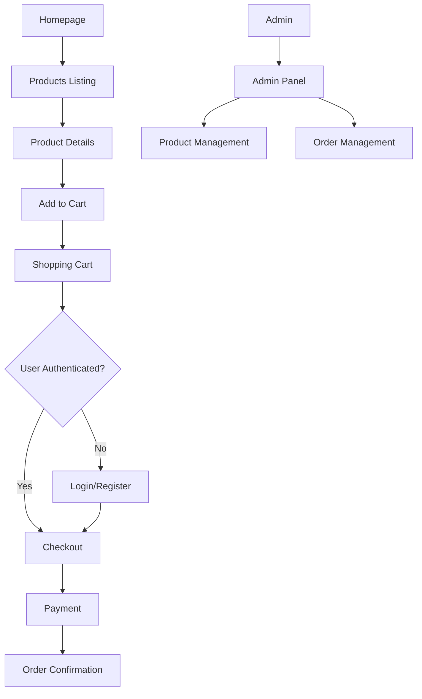

## 1. Product Overview
A production-ready eCommerce web application built with Next.js App Router, featuring Firebase authentication, MongoDB for product/order management, and Razorpay payment integration. The platform enables users to browse products, manage carts, and complete purchases with a modern, responsive interface.

Target market: Online retailers in India requiring a scalable eCommerce solution with secure payment processing and comprehensive product management.

## 2. Core Features

### 2.1 User Roles
| Role | Registration Method | Core Permissions |
|------|---------------------|------------------|
| Customer | Email/Password or Google Sign-In | Browse products, add to cart, place orders, manage profile |
| Admin | Pre-configured Firebase UID | Add/edit/delete products, view/manage orders, access admin panel |
| Guest | No registration required | Browse products, add to cart (localStorage only) |

### 2.2 Feature Module
Our eCommerce application consists of the following main pages:
1. **Homepage**: Hero section, featured products showcase, category navigation
2. **Products Listing**: Grid view with filters, search, pagination, sorting options
3. **Product Details**: Image gallery, product information, add to cart functionality
4. **Shopping Cart**: Item management, quantity adjustment, price calculation
5. **Checkout**: Address form, order summary, Razorpay payment integration
6. **User Profile**: Personal information, order history, address management
7. **Authentication**: Login/register with email/password and Google Sign-In
8. **Admin Panel**: Product management, order overview, basic analytics

### 2.3 Page Details
| Page Name | Module Name | Feature description |
|-----------|-------------|---------------------|
| Homepage | Hero Section | Display promotional banner with call-to-action buttons |
| Homepage | Featured Products | Showcase top-rated or promotional items in responsive grid |
| Homepage | Category Navigation | Quick access to product categories with icons |
| Products Listing | Product Grid | Display products with images, prices, ratings in responsive layout |
| Products Listing | Search Bar | Real-time product search with debounced input |
| Products Listing | Filters Sidebar | Category, price range, rating filters with instant updates |
| Products Listing | Pagination | Load more or numbered page navigation |
| Product Details | Image Gallery | Multiple product images with zoom and thumbnail navigation |
| Product Details | Product Info | Name, price, description, stock status, rating display |
| Product Details | Add to Cart | Quantity selector and add to cart button with success feedback |
| Shopping Cart | Cart Items | List view with product images, names, quantities, prices |
| Shopping Cart | Quantity Control | Increment/decrement buttons with stock validation |
| Shopping Cart | Remove Item | Delete button with confirmation and price recalculation |
| Shopping Cart | Cart Summary | Subtotal, shipping, tax, and total calculation |
| Checkout | Address Form | Shipping address input with validation |
| Checkout | Order Summary | Product list with quantities and total amount |
| Checkout | Payment Integration | Razorpay payment gateway with order creation |
| User Profile | Profile Info | Display and edit user details from Firestore |
| User Profile | Order History | List of past orders with status and details |
| User Profile | Address Management | Add, edit, delete shipping addresses |
| Authentication | Login Form | Email/password fields with validation |
| Authentication | Google Sign-In | One-click Google authentication button |
| Authentication | Registration | New user signup with email verification |
| Admin Panel | Product Management | Add new products with images, edit existing products |
| Admin Panel | Order Management | View all orders, update order status |

## 3. Core Process

### Customer Flow
1. User lands on homepage and browses featured products
2. User navigates to products listing page to explore catalog
3. User applies filters or searches for specific products
4. User clicks on product to view detailed information
5. User adds products to cart with desired quantity
6. User proceeds to cart to review items
7. User clicks checkout (requires authentication if not logged in)
8. User fills shipping address and reviews order summary
9. User completes payment via Razorpay
10. Order confirmation displayed and saved to database

### Admin Flow
1. Admin logs in with special privileges
2. Accesses admin panel from navigation
3. Manages products (add, edit, delete)
4. Views and processes customer orders
5. Updates order statuses

## 4. User Interface Design

### 4.1 Design Style
- **Primary Colors**: Indigo (#6366f1) for primary actions, Slate (#64748b) for text
- **Secondary Colors**: Emerald (#10b981) for success states, Rose (#f43f5e) for errors
- **Button Style**: Rounded corners (rounded-2xl), soft shadows, hover effects
- **Typography**: Inter font family, responsive sizing (text-sm to text-xl)
- **Layout**: Card-based design with consistent spacing, sticky navigation
- **Icons**: Heroicons for consistency, emoji sparingly for enhancement

### 4.2 Page Design Overview
| Page Name | Module Name | UI Elements |
|-----------|-------------|-------------|
| Homepage | Hero Section | Full-width banner with gradient overlay, prominent CTA buttons, responsive image |
| Homepage | Featured Products | 3-column grid on desktop, 2-column on tablet, 1-column on mobile |
| Products Listing | Product Grid | Card-based layout with hover shadows, price badges, rating stars |
| Product Details | Image Gallery | Main image with thumbnail strip below, zoom on hover |
| Shopping Cart | Cart Items | Clean table layout on desktop, card stack on mobile |
| Checkout | Address Form | Multi-step form with progress indicator, clear field labels |
| User Profile | Profile Section | Tabbed interface for different sections, clean form layout |
| Admin Panel | Product Table | Data table with action buttons, modal forms for editing |

### 4.3 Responsiveness
Mobile-first design approach with breakpoints:
- Mobile: 320px - 767px (single column layouts)
- Tablet: 768px - 1023px (two column layouts)
- Desktop: 1024px+ (multi-column layouts with sidebar)

Touch-optimized interactions with appropriate tap targets and swipe gestures for image galleries.

### 4.4 Dark Mode Support
System preference detection with manual toggle option. Dark mode uses:
- Background: Slate-900 (#0f172a)
- Surface: Slate-800 (#1e293b)
- Text: Slate-100 (#f1f5f9)
- Accent colors adjusted for proper contrast ratios